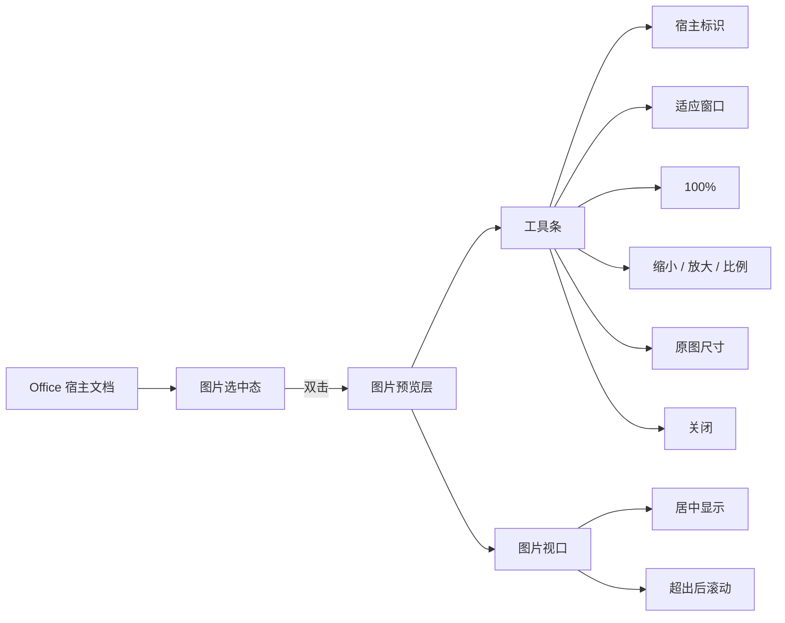
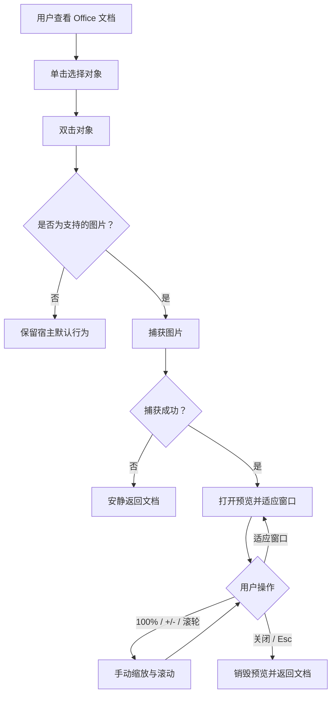

# OfficePicture 交互、原型与视觉设计文档

## 1. 体验原则

1. **一步即达**：用户沿用“选中后双击”的既有习惯，不增加 Ribbon、菜单或登录步骤。
2. **不破坏上下文**：预览覆盖在当前 Office 窗口之上，不改变文档对象、排版或 Office 缩放。
3. **图片优先**：界面退居背景，深色视口突出图片；信息与操作集中在单行工具条。
4. **可逆且可预期**：`Esc` 随时退出；“适应窗口”和“100%”语义明确；缩放有上下限。
5. **三宿主一致**：Word、PowerPoint、Excel 的触发实现可以不同，但预览操作必须一致。

## 2. 信息架构

OfficePicture 没有独立主页、设置页或内容层级，属于“上下文触发型单窗口工具”。



## 3. 主任务流



## 4. 关键界面线框

### 4.1 Office 文档上下文

```text
┌──────────────────────── Word / PowerPoint / Excel ────────────────────────┐
│ Ribbon                                                                     │
├────────────────────────────────────────────────────────────────────────────┤
│                                                                            │
│                    ┌────────────────────────┐                              │
│                    │                        │                              │
│                    │      已选中的图片      │  ← 先选中，再双击             │
│                    │                        │                              │
│                    └────────────────────────┘                              │
│                                                                            │
└────────────────────────────────────────────────────────────────────────────┘
```

设计要点：插件不新增常驻按钮，不抢占 Ribbon 空间；非图片对象不显示额外提示或悬浮控件。

### 4.2 预览层

```text
┌────────────────────────────────────────────────────────────────────────────┐
│ 图片预览 · Word  [适应窗口] [100%] │ [－] [＋]  76%   原图 1920 × 1080px [关闭 ✕] │
├────────────────────────────────────────────────────────────────────────────┤
│                                                                            │
│                  ┌───────────────────────────────────┐                     │
│                  │                                   │                     │
│                  │             图片内容              │                     │
│                  │                                   │                     │
│                  └───────────────────────────────────┘                     │
│                                                                            │
└────────────────────────────────────────────────────────────────────────────┘
```

设计要点：

- 工具条高度基线 44 px，左右内边距 12 px，上下内边距 6 px。
- 视口四周保留 20 px，避免图片贴边。
- 左侧呈现任务与主要控制，右侧呈现只读尺寸和关闭动作。
- 当前代码采用无标题栏窗口；因此关闭入口与 `Esc` 必须始终可靠。

### 4.3 放大与滚动态

```text
┌────────────────────────────────────────────────────────────────────────────┐
│ 图片预览 · Excel  [适应窗口] [100%] │ [－] [＋]  200%  原图 2400 × 1600px [关闭 ✕]│
├────────────────────────────────────────────────────────────────────────────┤
│ ┌──────────────────────── 图片局部 ───────────────────────────────────┐  ↕ │
│ │                                                                      │  │ │
│ │                    当前视口只显示原图的一部分                        │  │ │
│ │                                                                      │  │ │
│ └──────────────────────────────────────────────────────────────────────┘  │ │
│ ◀━━━━━━━━━━━━━━━━━━━━━━━━━━━━━━━━━━━━━━━━━━━━━━━━━━━━━━━━━━━━━━━━━━━━━━▶  │
└────────────────────────────────────────────────────────────────────────────┘
```

设计要点：手动缩放后退出“适应窗口”模式；图像超过视口时使用原生滚动条查看，不缩回窗口。

## 5. 可点击原型

打开 [prototype/index.html](./prototype/index.html)。原型用于验证以下交互：

- Word / PowerPoint / Excel 宿主文案切换。
- 从文档选中态双击进入预览。
- “适应窗口”“100%”“＋”“－”与滚轮缩放。
- `+`、`-`、`Esc` 键盘操作。
- 缩放后图片尺寸、百分比、居中/溢出状态变化。

原型是行为说明，不是像素级复刻；真实实现以 WinForms 和 Office 宿主窗口为准。

## 6. 交互规格

| ID | 控件/动作 | 触发 | 结果 | 边界/反馈 |
|---|---|---|---|---|
| UX-01 | 图片 | 单击 | 对象进入 Office 选中态 | 由宿主原生选框反馈 |
| UX-02 | 图片 | 双击 | 支持对象打开预览 | 捕获失败时当前版本安静返回 |
| UX-03 | 适应窗口 | 点击 | 按视口重新计算缩放，进入 Fit 模式 | 窗口后续变化继续适配 |
| UX-04 | 100% | 点击 | 缩放设为 100%，进入 Manual 模式 | 可能出现滚动条 |
| UX-05 | － | 点击 | 当前比例 ÷ 1.2 | 最低 10% |
| UX-06 | ＋ | 点击 | 当前比例 × 1.2 | 最高 800% |
| UX-07 | 图片视口 | 滚轮向上/下 | 当前比例 ×/÷ 1.15 | 进入 Manual 模式 |
| UX-08 | `+` / `-` | 键盘 | 与工具条加减一致 | 输入焦点在预览窗口时有效 |
| UX-09 | 关闭 ✕ | 点击 | 关闭预览 | 回到宿主，进入 400 ms 去重期 |
| UX-10 | `Esc` | 键盘 | 关闭预览 | 与关闭按钮一致 |
| UX-11 | 窗口 | 调整大小 | Fit 模式重算；Manual 模式比例不变 | 保持工具条可用 |

## 7. 页面与组件状态

### 7.1 宿主文档

| 状态 | 表现 | 插件行为 |
|---|---|---|
| 未选中 | Office 原生文档 | 无行为 |
| 选中支持图片 | Office 原生选择框 | 等待双击 |
| 选中不支持对象 | Office 原生选择框 | 不接管双击 |
| 捕获中 | 当前实现无专门反馈 | 操作应足够短；超过 500 ms 后 P1 建议显示忙碌光标 |

### 7.2 预览窗口

| 状态 | 当前比例 | 图片布局 | 调整窗口 |
|---|---:|---|---|
| Fit | 自动 | 完整可见、居中 | 自动重算 |
| 100% | 100% | 像素比例，必要时滚动 | 不重算 |
| Manual/小图 | 10%～800% | 视口中居中 | 比例不变 |
| Manual/大图 | 10%～800% | 从边距开始并可滚动 | 比例不变 |
| Closing | 任意 | 窗口销毁 | 不接受新预览 |

## 8. 视觉规范

### 8.1 色彩（现状基线）

| Token | 值 | 用途 |
|---|---|---|
| `preview.canvas` | RGB(28, 28, 30) / `#1C1C1E` | 预览背景与窗体 |
| `preview.toolbar` | RGB(38, 38, 41) / `#262629` | 顶部工具条 |
| `text.primary` | `#FFFFFF` | 标题、操作、比例 |
| `text.secondary` | `Gainsboro` / `#DCDCDC` | 原图尺寸 |
| `separator` | 系统 ToolStrip 分隔线 | 控件分组 |

色彩采用固定深色查看环境，不跟随 Office 主题。P1 若支持主题，应保留深色作为图片查看默认，并验证 Windows 高对比度模式。

### 8.2 字体

- 使用系统消息框字体，兼容当前 Windows UI 语言和缩放设置。
- 标题使用系统字体粗体；其余为常规字重。
- 不应使用图片内嵌文字代替真实控件文本。

### 8.3 间距与尺寸

| 项目 | 规格 |
|---|---:|
| 工具条高度 | 44 px |
| 工具条内边距 | 左右 12 px，上下 6 px |
| 标题右间距 | 16 px |
| 普通按钮水平间距 | 2 px |
| 比例标签水平外边距 | 8 px |
| 视口内边距 | 20 px |
| 相对宿主窗口内缩 | 12 px |
| 默认窗体 | 1000 × 720 px |
| 最小窗体 | 480 × 360 px |

### 8.4 控件分组

顺序固定为：`标题/宿主` → `适应窗口` → `100%` → 分隔 → `缩小` → `放大` → `比例` → 分隔 → 弹性空间 → `原图尺寸` → `关闭`。

若窗口过窄，当前 ToolStrip 可能出现溢出菜单。P1 设计建议：优先保留关闭、缩放比例、适应窗口；将原图尺寸隐藏到 640 px 以下，避免核心控件进入溢出。

## 9. 文案规范

| 场景 | 文案 | 规则 |
|---|---|---|
| 窗口标题 | `图片预览 - {宿主}` | 系统/辅助技术语义 |
| 工具条标题 | `图片预览 · {宿主}` | `{宿主}` 为 Word / PowerPoint / Excel |
| 自适应 | `适应窗口` | 描述结果，不用“自动” |
| 原始比例 | `100%` | 表示图像像素比例 |
| 比例 | `{zoom:P0}` | 取整数百分比，如 `76%` |
| 图片信息 | `原图 {宽} × {高}px` | 使用乘号 `×`，单位紧随数值 |
| 关闭 | `关闭  ✕` | 同时提供文字和符号 |

错误提示原则：只有用户可采取行动时才显示；瞬态失败优先本地诊断日志，不弹出阻断式消息框。若连续失败，可显示“暂时无法读取所选图片，请重新选择后再试”。

## 10. 无障碍与键盘

### 当前已具备

- `Esc` 关闭。
- `+` / `-` 缩放。
- 按钮均有可见文字。
- 深色背景与白色文字具有高对比度。

### P1 应补齐

- 明确 Tab 顺序与可见焦点样式。
- 为 PictureBox 提供可访问名称，例如“图片预览区域”。
- 为比例标签使用可读名称“当前缩放比例 100%”。
- 支持 `Ctrl+0` 适应窗口、`Ctrl+1` 100%。
- 支持高对比度模式和 100%～250% DPI，不以颜色作为唯一状态提示。
- 在系统启用“减少动画”时不引入额外动画；当前版本本身无动画。

## 11. 响应式与多显示器规则

- 有宿主父窗口：预览跟随该窗口，而不是跟随主屏幕。
- 无父窗口：使用鼠标所在屏幕的工作区并居中。
- Fit 的可用空间为视口宽高各减 40 px。
- 图片比例不变形，始终使用等比缩放。
- 手动缩放的大图通过双向滚动条访问全部区域。
- P1 应使用 DPI 感知 API，保证 12/20/44 px 规格在不同缩放设置下具有一致的有效尺寸。

## 12. 设计验收清单

- [ ] 三宿主进入预览后的控件、文案、顺序一致。
- [ ] 首屏图片完整可见且没有拉伸。
- [ ] 10% 和 800% 边界不可越过。
- [ ] 比例标签与实际图片尺寸同步。
- [ ] 从 Fit 切换到手动缩放后，窗口变化不重置比例。
- [ ] 点击适应窗口后恢复跟随窗口。
- [ ] 大图在 100% 和放大状态下可访问全部区域。
- [ ] `Esc`、`+`、`-` 全部可用。
- [ ] 窄窗口仍能关闭并执行主要缩放操作。
- [ ] 高 DPI、多屏、系统高对比度下核心信息可见。

