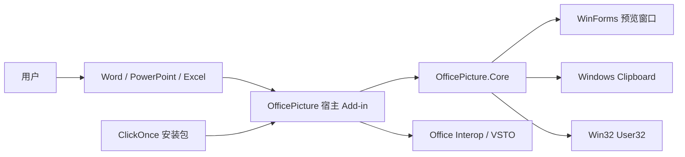
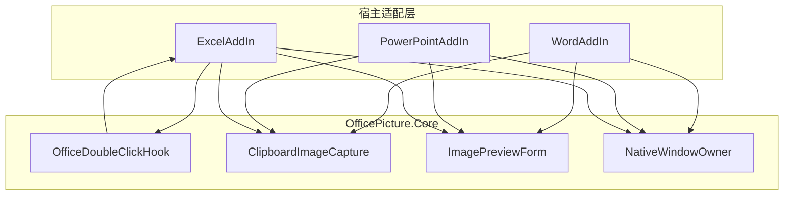
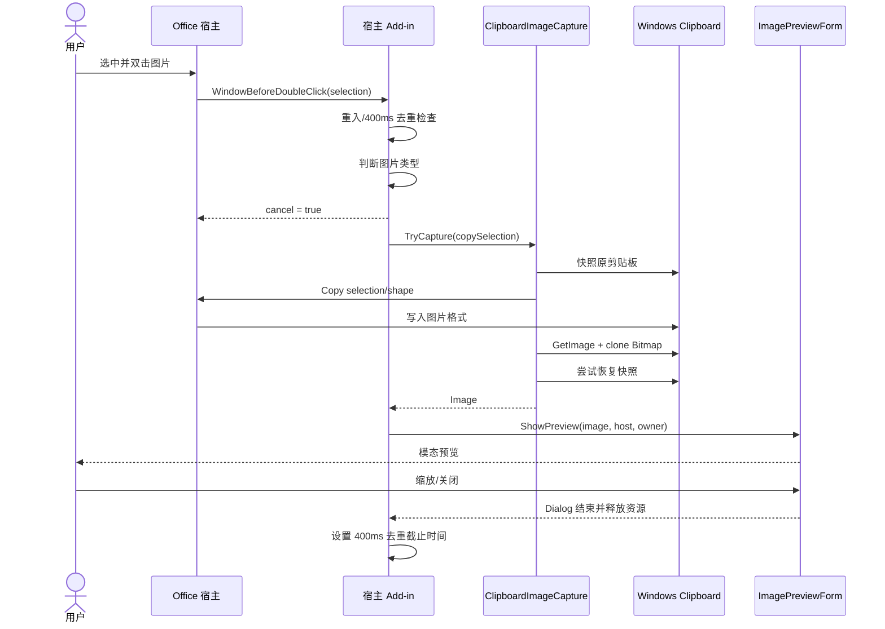
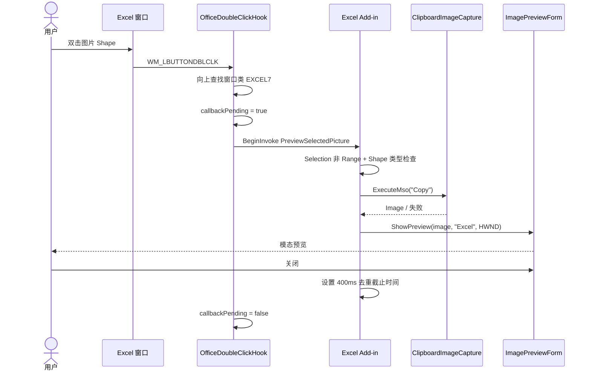
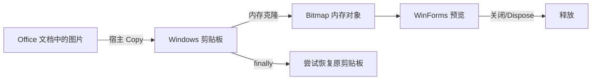

# OfficePicture 技术设计文档

## 1. 技术概览

OfficePicture 是四项目组成的 Windows 桌面解决方案：一个无 Office 依赖的通用 Core 库，加上 Word、PowerPoint、Excel 三个 VSTO Add-in。各宿主适配层负责“何时触发、当前对象是否为图片、如何复制”，Core 负责剪贴板捕获、父窗口适配、Excel 双击钩子和统一预览。

| 维度 | 现状 |
|---|---|
| 语言/运行时 | C#，.NET Framework 4.7.2 |
| UI | Windows Forms |
| Office 集成 | VSTO + Office Interop |
| 原生集成 | Win32 User32 Hook、窗口类名与窗口矩形 |
| 图片传递 | Windows Clipboard → `System.Drawing.Bitmap` |
| 部署 | ClickOnce，三个宿主独立包 |
| 构建 | Visual Studio/MSBuild，AnyCPU |

## 2. 系统上下文



系统无网络依赖、数据库、后台服务或账号体系。图片仅在 Office 进程内存和系统剪贴板短暂存在。

## 3. 代码模块

| 项目/类 | 职责 | 依赖 | 不负责 |
|---|---|---|---|
| `OfficePicture.WordAddIn.ThisAddIn` | Word 事件、Selection 图片判断、复制、宿主 HWND | Word Interop、Core | 预览 UI、缩放算法 |
| `OfficePicture.PowerPointAddIn.ThisAddIn` | PPT 事件、Shape 类型判断、复制、宿主 HWND | PowerPoint Interop、Core | 通用捕获与窗口布局 |
| `OfficePicture.ExcelAddIn.ThisAddIn` | Excel Hook 生命周期、Selection/Shape 判断、ExecuteMso Copy | Excel Interop、Core | Hook 细节、预览 UI |
| `OfficeDoubleClickHook` | 当前线程 `WH_GETMESSAGE` Hook、筛选 `WM_LBUTTONDBLCLK` 与窗口类 | User32、WinForms Control | 对象判断、图片捕获 |
| `ClipboardImageCapture` | 快照剪贴板、执行复制、克隆图片、尝试恢复 | WinForms Clipboard、GDI+ | 判断 Office 对象类型 |
| `ImagePreviewForm` | 窗口、工具条、缩放、滚动、键盘、资源释放 | WinForms、User32 | Office Interop |
| `NativeWindowOwner` | 将 Office HWND 适配为 `IWin32Window` | WinForms | 句柄所有权 |

## 4. 组件架构



设计判断：Core 没有直接引用 Office Interop，因此预览和捕获逻辑可独立测试/演进；但 `OfficeDoubleClickHook` 实际只被 Excel 使用，未来可移到 Excel 基础设施层以保持 Core 纯粹。

## 5. 关键时序

### 5.1 Word / PowerPoint



### 5.2 Excel



## 6. 触发与对象识别

### 6.1 Word

- 订阅 `Application.WindowBeforeDoubleClick`。
- 优先检查 `Selection.InlineShapes[1]` 的 `wdInlineShapePicture` / `wdInlineShapeLinkedPicture`。
- 若无 InlineShape，尝试 `ShapeRange[1].Type`。
- 认可的 Mso 类型数值：11、13、28、29。建议在后续代码中改为具名枚举/兼容映射并注释版本来源。

### 6.2 PowerPoint

- 订阅 `Application.WindowBeforeDoubleClick`。
- 要求 `Selection.Type == ppSelectionShapes` 且 ShapeRange 非空。
- 仅检查 ShapeRange 中第一个对象；组合或多选的行为应在测试中明确。
- 认可同一组图片类型数值。

### 6.3 Excel

- Excel 缺少等价的 Shape 双击事件，因此在 Add-in 启动时安装当前 UI 线程 `WH_GETMESSAGE` Hook。
- 仅接受 `WM_LBUTTONDBLCLK`，且消息窗口或其父窗口类名包含 `EXCEL7`。
- 回调通过隐藏 WinForms `Control.BeginInvoke` 排入 UI 消息循环，避免在 Hook 回调中直接访问复杂 Interop。
- 当前 Selection 若为 `Excel.Range` 直接退出；否则反射读取 `Name`，再从 ActiveSheet.Shapes 查找并判断类型。

## 7. 图片捕获协议

### 7.1 现有算法

1. 调用 `Clipboard.GetDataObject()`。
2. 枚举全部格式，逐个 `GetData` 后写入新的 `DataObject` 快照。
3. 执行宿主提供的复制委托。
4. 调用 `Application.DoEvents()` 允许 Office 完成剪贴板写入。
5. 检查 `Clipboard.ContainsImage()`，获取并克隆为 `Bitmap`。
6. 在 `finally` 中调用 `Clipboard.SetDataObject(snapshot, true)` 尝试恢复。

### 7.2 设计优点

- 不依赖图片源文件存在。
- 三宿主复用统一捕获逻辑。
- 克隆后不再依赖剪贴板对象生命周期。
- 失败路径集中处理 `ExternalException` / `InvalidOperationException`。

### 7.3 已知风险与改进

| 风险 | 影响 | 建议 |
|---|---|---|
| `DoEvents()` 可导致重入 | 事件顺序复杂 | 保留重入锁；P1 改为有界重试读取剪贴板 |
| 剪贴板异步/延迟渲染 | 立即读取可能失败 | 20～50 ms 退避，总计不超过 300 ms |
| 快照不是所有格式都可安全复制 | 可能丢失自定义/延迟格式 | 记录无法快照的格式；文档化限制 |
| 恢复时覆盖外部程序刚写入的新内容 | 用户数据风险 | 读取 Win32 剪贴板序列号，序列符合预期时才恢复 |
| 大图完整克隆占用大量内存 | 宿主卡顿/OOM | 设像素/内存阈值，按显示需要生成预览位图 |
| Office 复制可能改变选择状态 | 上下文变化 | 增加宿主回归测试，必要时保存并恢复选区 |

## 8. 预览与缩放算法

### 8.1 窗口定位

- 有 Owner 且 `GetWindowRect` 成功：`Bounds = ownerRect` 每边内缩 12 px。
- 宽高下限分别为 480、360；当前算法在宿主很小时可能超出 Owner。
- 无 Owner：使用 `Screen.FromPoint(Cursor.Position).WorkingArea` 居中，且不超过工作区。
- 模态显示：有 Owner 使用 `ShowDialog(owner)`，否则 `ShowDialog()`。

### 8.2 Fit 算法

设原图为 `Iw × Ih`，视口为 `Vw × Vh`，边距总量为 40：

```text
zoom = min((Vw - 40) / Iw, (Vh - 40) / Ih)
zoom = clamp(zoom, 0.1, 8.0)
renderSize = round(imageSize × zoom)
```

图片位置为 `(max(20, (Vw - Rw)/2), max(20, (Vh - Rh)/2))`。因此可见范围内居中，溢出时从 20 px 边距开始，Panel 通过 `AutoScrollMinSize` 提供滚动。

### 8.3 状态规则

- `_fitToWindow = true`：首次显示、点击适应窗口；Resize 触发重新 Fit。
- `_fitToWindow = false`：100%、按钮、滚轮、键盘手动缩放；Resize 只重新布局，不改变当前实现中的比例。注意：当前 Resize 仅在 Fit 时调用布局，Manual 模式窗口变大后图片位置不会主动重新居中，这是 P1 可修复的行为差异。
- 工具条加减倍率 1.2；滚轮倍率 1.15；统一 Clamp 到 0.1～8.0。

## 9. 生命周期、线程与资源

- VSTO 事件和 Hook 回调最终在 Office UI 线程执行。
- `ImagePreviewForm` 为同步模态调用，打开期间宿主操作被阻塞，这是“专注查看”的当前设计取舍。
- Add-in 层 `_previewOpen` 阻止窗口重入；关闭后 `_suppressPreviewUntilUtc` 提供 400 ms 去重。
- Hook 层 `_callbackPending` 阻止消息回调重复排队。
- 捕获返回的 Image 在 Add-in 层 `using`；Form 构造时再次克隆并在 Dispose 中释放。
- Hook 在 Excel Add-in Shutdown 时卸载，dispatcher Control 同时释放。

## 10. 异常策略

当前宿主层使用宽泛 `catch` 保护 Office 进程，Core 捕获常见剪贴板异常。这符合“失败不影响宿主”的底线，但降低可诊断性。

P1 建议引入：

```text
错误分类 = Trigger / Selection / ClipboardSnapshot / OfficeCopy /
           ClipboardRead / ClipboardRestore / Preview / NativeHook
```

- 仍不向 Office 冒泡异常。
- 默认只写本地滚动日志，包含时间、宿主、版本、错误分类、HRESULT、耗时，不含文档名、路径、选区文本、图片数据或剪贴板内容。
- 连续失败或不可恢复配置错误才向用户显示非阻断提示。

## 11. 安全与隐私设计

### 数据流



- 不落盘、不联网、不上传。
- 进程内图片对象最小生命周期，用后释放。
- 发布签名私钥不得进入仓库；测试证书只用于内部环境。
- ClickOnce 的发布者名称、证书主题、产品版本应与发布说明一致。

## 12. 构建与部署设计

### 12.1 构建

- 解决方案包含 Core 和三个 Add-in 项目。
- 目标框架统一为 .NET Framework 4.7.2，C# 最新语言版本、Nullable 开启。
- Add-in 引用 Office 15.0 Interop；设计时可通过 COMReference 生成类型信息。
- `AnyCPU` 需要在 32/64 位 Office 上分别验证实际加载和原生 API 互操作。

### 12.2 发布

`build/Publish.ps1 -Version x.x.x.x`：

1. 从 Word 项目读取 `ManifestKeyFile` 与证书指纹。
2. 用 `vswhere` 定位最新 MSBuild。
3. 为三个项目依次执行 `Publish`。
4. 统一版本、证书、PublisherName，并生成离线 bootstrapper。
5. 输出至 `publish/Word|PowerPoint|Excel`。

现状限制：脚本要求 Word 项目本地存在签名配置，并把同一证书参数传给三个项目。正式流水线应从安全证书存储注入签名，不依赖开发者项目文件里的临时证书。

## 13. 兼容性策略

| 层 | 需要验证 |
|---|---|
| Windows | Windows 10/11；标准、高对比度、多屏、不同 DPI |
| Office | 2016/2019/2021/Microsoft 365；32/64 位；零售与企业更新通道 |
| 对象 | 插入、链接、浮动、裁剪、透明 PNG、高分辨率 JPEG、扫描图 |
| 文档状态 | 新建、已保存、只读、受保护视图、兼容模式 |
| 剪贴板 | 文本、富文本、图片、文件列表、自定义格式、被占用 |
| 安装 | 首装、覆盖升级、降级阻止、修复、卸载、证书不受信任 |

受保护视图、管理员策略、禁用 VSTO 或禁用剪贴板等环境可能阻止功能，应作为受限环境明确说明，而不是通过绕过安全策略解决。

## 14. 测试架构建议

- **Core 单元测试**：缩放 Clamp、Fit 计算、窗口布局纯函数化后测试；剪贴板通过接口注入。
- **宿主适配契约测试**：将对象类型判断提取为映射函数，覆盖每个支持/不支持类型。
- **UI 自动化**：WinAppDriver/UI Automation 验证工具条命令、比例、Esc 和窗口归属。
- **Office 集成测试**：为三宿主准备固定样本文档，自动或半自动触发并保存结果。
- **发布冒烟**：在干净 VM 安装、启动、预览、升级、卸载。
- **资源测试**：连续打开关闭 500 次，观察 GDI Handle、Private Bytes 和宿主稳定性。

## 15. 架构决策记录（ADR 摘要）

| ADR | 决策 | 理由 | 代价 |
|---|---|---|---|
| ADR-001 | 使用 VSTO 而非 Web Add-in | 需要桌面宿主事件、原生窗口和剪贴板能力 | 仅 Windows 桌面，部署复杂 |
| ADR-002 | 使用宿主 Copy + Clipboard | 跨宿主统一，支持无源路径图片 | 剪贴板竞争、可能非原始编码 |
| ADR-003 | 使用 WinForms 无边框模态窗 | 开发简单、原生、父窗口关系清晰 | 样式/无障碍/DPI 需额外处理 |
| ADR-004 | Excel 使用当前线程消息 Hook | 缺少 Shape 双击事件 | 依赖窗口类与 Win32 行为 |
| ADR-005 | Core 与宿主适配分离 | 三宿主复用 UI/捕获逻辑 | 仍需三个安装与项目配置 |
| ADR-006 | 400 ms 关闭后去重 | 避免同次双击残留事件再次打开 | 极快的下一次有效双击会被忽略 |

## 16. 后续演进接口建议

为避免继续在 `ThisAddIn` 中堆叠逻辑，可引入以下抽象：

```csharp
public interface IOfficePictureSource
{
    string HostName { get; }
    IntPtr OwnerWindow { get; }
    bool IsSupportedSelection();
    void CopySelection();
}

public interface IClipboardImageReader
{
    ImageCaptureResult Capture(Action copySelection);
}

public interface IPreviewPresenter
{
    void Show(Image image, PreviewContext context);
}
```

同时将 Fit/Zoom 提炼为无 UI 依赖的 `ZoomModel`，让 WinForms 只负责渲染。这会直接提升单元测试覆盖和未来切换 WPF/WinUI 的可行性。

